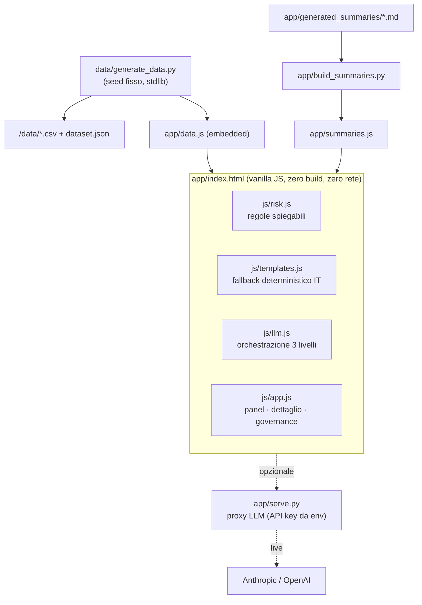
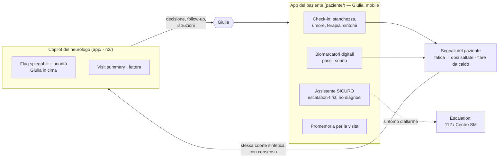

# ARCHITECTURE.md — NeuroInflammation Copilot

> Sfida #2 **HCP Digital Copilot**. Questo documento copre gli output richiesti dalla giuria:
> **mappa del workflow**, **ruolo del copilot**, **dati usati**, **output generati**,
> **decisioni che restano al clinico**, **rischi e mitigazioni**.

## 1. Workflow clinico (dove si inserisce il copilot)

```mermaid
flowchart LR
    subgraph Sorgenti["Dati eterogenei (sintetici)"]
      EHR[Cartella clinica<br/>referti neurologici]
      MRI[RMN: nuove/captanti<br/>PRL, atrofia]
      LAB[Biomarcatori sierici<br/>NfL, GFAP]
      SCALES[Scale: EDSS, SDMT<br/>T25FW, 9-HPT]
      PRO[PRO: MFIS, PHQ-9<br/>MSIS-29]
      WEAR[Wearable: passi<br/>cammino, sonno]
      DMT[Storia terapeutica<br/>aderenza, monitoraggio]
    end

    Sorgenti --> ENG

    subgraph Copilot["NeuroInflammation Copilot"]
      ENG[Risk engine TRASPARENTE<br/>regole spiegabili]
      PANEL[Vista Panel:<br/>prioritizzazione + PERCHÉ]
      DETAIL[Vista Dettaglio:<br/>timeline + trend + biomarcatori digitali]
      GEN[Generazione bozze:<br/>visit summary · lettera · istruzioni]
      ENG --> PANEL --> DETAIL --> GEN
    end

    GEN -->|bozza DA VALIDARE| CLIN

    subgraph Decisione["Il clinico al centro"]
      CLIN{{Neurologo + team:<br/>rivede, integra, decide, FIRMA}}
    end

    CLIN -->|valida/firma| AUDIT[Audit trail]
    CLIN -->|azione clinica| ACT[RMN anticipata · switch DMT ·<br/>gestione sintomi · monitoraggio]
    GOV[[Governance: intended use ·<br/>disclaimer · privacy/GDPR]] -.-> Copilot
```

**In una frase:** il copilot **legge** dati eterogenei, **prioritizza** i pazienti con regole
trasparenti, **fa emergere** segnali precoci e sintomi invisibili, **prepara** bozze pre-visita —
e il **clinico decide e firma**.

## 2. Ruolo preciso del copilot (e cosa NON fa)
| Il copilot FA | Il copilot NON fa |
|---|---|
| Prioritizza la coorte per rischio, con scomposizione dei contributi | Non diagnostica |
| Espone i fattori dietro ogni flag (spiegabilità) | Non decide la terapia |
| Sintetizza la storia longitudinale (trend, timeline) | Non avvia azioni in autonomia |
| Genera bozze (summary, lettera, istruzioni) | Non firma nulla al posto del medico |
| Segnala gap di monitoraggio/sicurezza e pseudo-ricadute | Non sostituisce l'esame obiettivo |

## 3. Dati usati
Cartella/referti, RMN (nuove/ingrandite/captanti, PRL, atrofia), biomarcatori sierici (NfL, GFAP
con soglie per età), scale (EDSS, SDMT, T25FW, 9-HPT), PRO (MFIS, PHQ-9, MSIS-29), biomarcatori
digitali da wearable (passi, velocità del cammino, sonno), storia terapeutica + aderenza + agenda
di monitoraggio. **Tutti sintetici** (vedi [data dictionary](data/data_dictionary.md)).

## 4. Output generati
- **Visit summary pre-visita** (one-pager strutturato).
- **Bozza di lettera/relazione** clinica.
- **Istruzioni post-visita** in linguaggio semplice.
- **Flag + “perché”** e **punteggio di priorità** con contributi.
- **Audit trail** delle generazioni/validazioni.

Tre livelli di generazione (degradazione graziosa, la demo non dipende mai dalla rete):
**(1) LLM live** opzionale → **(2) riassunti curati** offline → **(3) template deterministico** dai dati.

## 5. Decisioni che restano al clinico
Conferma/rifiuto dei flag, scelta di anticipare la RMN, modifica/switch della DMT, gestione dei
sintomi, interpretazione di una pseudo-ricaduta, validazione e **firma** di ogni documento. Il
copilot resta **decision support** (uomo-nel-loop).

## 6. Architettura tecnica (self-contained, offline-first)

- **Nessun framework, nessun `node_modules`, nessuna build.** Si apre con doppio click su `app/index.html` (`file://`).
- Dati **embeddati** via `<script>` (niente `fetch` → nessun problema CORS in `file://`).
- Grafici e sparkline in **SVG inline** (nessuna libreria di charting).
- LLM live **opzionale**: `app/serve.py` legge la API key da env e fa da proxy same-origin (la chiave non arriva al browser). In assenza → fallback offline.

## 7. Rischi principali e mitigazioni
| Rischio | Mitigazione |
|---|---|
| Over-reliance / automation bias | Decision support con uomo-nel-loop; ogni output è bozza **da firmare**; flag sempre spiegati |
| Black box / opacità | Regole **leggibili**, pannello “Perché?”, scomposizione del punteggio; nessun modello opaco |
| Errori dell'LLM / allucinazioni | LLM **opzionale**; prompt vincolato ai dati; fallback deterministico; output etichettato come bozza |
| Falsi allarmi (es. NfL rumoroso) | Soglie con **trend** (non singolo dato); convergenza di ≥2 segnali per gravità alta |
| Confondere attività e progressione | Flag distinti `disease_activity` vs `pira_smouldering` |
| Confondere fallimento farmaco e non-aderenza | `suboptimal` **modulato/soppresso** dall'aderenza |
| Pseudo-ricaduta scambiata per ricaduta | Insight dedicato che invita a distinguere prima di agire |
| Privacy / dati sensibili | Dati **sintetici**; in produzione: pseudonimizzazione, GDPR, cifratura, RBAC, audit server-side |
| Dipendenza dalla rete in demo | **Offline-first**: tutto embeddato, LLM live opzionale |
| Stato regolatorio | Intended use esplicito; profilo **CDS**; percorso medical device/CE in roadmap |

## 8. Intended use & classificazione
Strumento di **Clinical Decision Support** per neurologo/team multidisciplinare in SM e malattie
neuroinfiammatorie. **Non** dispositivo diagnostico autonomo. In sviluppo reale: intended use
formale, classificazione come software medical device, validazione clinica e percorso regolatorio
(vedi [VALIDATION_KPI.md](VALIDATION_KPI.md)).

## 9. L'ecosistema a due lati: il loop paziente ↔ clinico
Il prototipo non è solo il copilot del neurologo: include l'**app del paziente** (`paziente/`,
"L'app di Giulia"), che è il punto in cui i segnali **nascono**. Le due app condividono la stessa
coorte sintetica, chiudendo il loop tra una visita e l'altra.

**Sicurezza dell'assistente paziente (superficie ad alto rischio).** Pipeline *escalation-first*:
un classificatore deterministico intercetta emergenze (112), crisi di salute mentale, possibili
ricadute (>24h), febbre/infezione e richieste di diagnosi/modifica terapia **prima** di qualunque
risposta tematica; l'eventuale LLM live interviene solo sui messaggi non coperti ed è **ri-classificato**
dalla rete di sicurezza. Niente diagnosi, niente modifiche di terapia, niente over-reassurance.
Default **offline** con base di conoscenza curata. Contenuto clinico revisionato dall'agente
`clinical-guardian` (vedi [AGENTS.md](AGENTS.md)).

> Perché conta per la giuria: dimostra il **valore tra una visita e l'altra** e l'**intercettazione
> precoce** — il paziente genera dati interpretabili, il copilot li trasforma in priorità spiegabili,
> il clinico decide. Un unico anello, con la sicurezza by-design su entrambi i lati.
